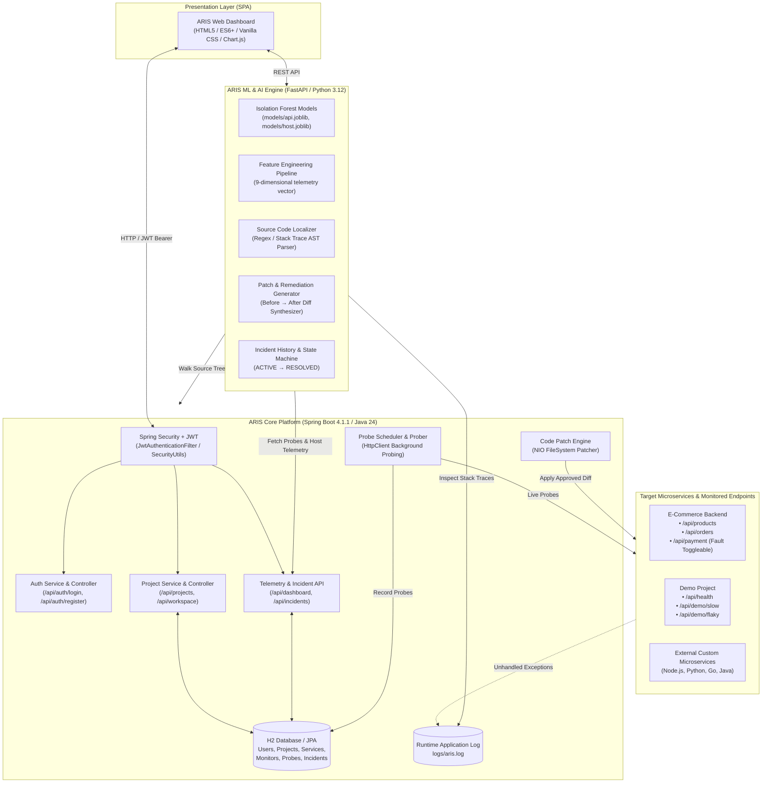

# ARIS — System Architecture & Technical Design

**ARIS (Autonomous Reliability & Intelligence System)** is an autonomous observability, anomaly detection, and automated site reliability engineering (SRE) platform. It continuously monitors distributed APIs, learns baseline operational behavior using unsupervised machine learning (Isolation Forest), detects multidimensional anomalies, pinpoints root-cause code locations from runtime stack traces, and suggests developer-approvable code patches with automated recovery verification.

---

## 1. High-Level Architecture Diagram



---

## 2. Core ML / SRE Pipeline Architecture

The platform operates on a closed-loop reliability feedback cycle:

$$\mathbf{Historical\ Telemetry} \longrightarrow \mathbf{Feature\ Engineering} \longrightarrow \mathbf{Isolation\ Forest} \longrightarrow \mathbf{Anomaly\ Score} \longrightarrow \mathbf{Incident} \longrightarrow \mathbf{AI\ Root\ Cause} \longrightarrow \mathbf{Fix\ Recommendation}$$

### Pipeline Phases

```
┌─────────────────────────────────────────────────────────────────────────────────┐
│ 1. Telemetry Collection                                                         │
│    • Latency (ms)           • Request Rate (req/s)       • Error Rate (4xx/5xx) │
│    • Host CPU (%)           • Host Memory (%)            • Timeouts (HTTP 0)    │
│    • Rate-Limit 429 Counts                                                      │
└────────────────────────────────────────┬────────────────────────────────────────┘
                                         ▼
┌─────────────────────────────────────────────────────────────────────────────────┐
│ 2. Feature Engineering                                                          │
│    • Extracts 9-dimensional vector: [mean_lat, max_lat, last_lat, req_rate,     │
│      error_rate, cpu_pct, ram_pct, timeout_count, rate_limit_count]             │
│    • Computes running baseline statistics: Mean (μ) and Std Dev (σ)             │
└────────────────────────────────────────┬────────────────────────────────────────┘
                                         ▼
┌─────────────────────────────────────────────────────────────────────────────────┐
│ 3. Isolation Forest Evaluation                                                  │
│    • Model: 200 estimators, 3% contamination, trained on normal operations     │
│    • Anomaly Score: s = -score_samples(X) ∈ [0, 1]                              │
│    • Binary Decision: predict(X) == -1 (Anomaly Detected)                       │
│    • Formulates Evidence Tags: z = (X - μ) / σ                                  │
└────────────────────────────────────────┬────────────────────────────────────────┘
                                         ▼
┌─────────────────────────────────────────────────────────────────────────────────┐
│ 4. Incident Escalation & Memory                                                 │
│    • Triggered when score ≥ 0.60 or predict == -1                               │
│    • Emits unique Incident ID (INC-xxx) bound to Project ID                     │
│    • Sets status = ACTIVE, computes confidence (75-99%) and severity            │
└────────────────────────────────────────┬────────────────────────────────────────┘
                                         ▼
┌─────────────────────────────────────────────────────────────────────────────────┐
│ 5. Code-Level Root Cause Diagnosis                                              │
│    • Tails project log file (logs/aris.log)                                     │
│    • Regex matches newest Java stack trace: at package.Class.method(File:line)  │
│    • Identifies exact source file, function name, and line number               │
└────────────────────────────────────────┬────────────────────────────────────────┘
                                         ▼
┌─────────────────────────────────────────────────────────────────────────────────┐
│ 6. Remediation & Code Patch Synthesis                                           │
│    • Generates step-by-step SRE remediation action checklist                    │
│    • Generates Before → After code patch diff with circuit breaker logic        │
│    • Developer reviews and applies patch with one click                         │
│    • Live prober validates telemetry normalization → Incident marks RESOLVED    │
└─────────────────────────────────────────────────────────────────────────────────┘
```

---

## 3. Data Model & Entity Relationship Hierarchy

ARIS enforces a strict hierarchical relational schema:

```
User (owner_id)
  │
  └── Project (id, name, apiKey, sourcePath, logPath)
        │
        └── Service (id, name, baseUrl)
              │
              ├── Monitor (id, endpoint, method, interval, timeout)
              │     │
              │     └── ProbeResult (timestamp, latencyMs, statusCode, error)
              │
              └── Incident (id, failureType, severity, anomalyScore, rootCause, status)
```

### Relational Entities:
* **`User`**: Core identity entity storing `email`, bcrypt-hashed `password`, `name`, and `Role` (`ADMIN`, `DEVELOPER`).
* **`Project`**: Root organizational boundary. Belongs to a single `User`. Contains auto-generated API Key (`aris_live_...`), path to source code repository (`sourcePath`), and runtime log file (`logPath`).
* **`Service`**: Logical microservice component within a project with a defined `baseUrl` (e.g. `http://localhost:8080`).
* **`Monitor`**: Monitored API endpoint configuration (e.g. `/api/payment`, method `GET`, polling interval `5s`, timeout `5s`).
* **`ProbeResult`**: Time-series observation record storing latency in milliseconds, HTTP response status code, payload byte size, and error strings.
* **`Incident`**: Incident lifecycle tracking record storing anomaly score, confidence score, failure type (`server_error`, `latency`, `rate_limit`, `unreachable`), code location, and resolution status (`OPEN`, `ACKNOWLEDGED`, `RESOLVED`).

---

## 4. Multi-Tenant Project Ownership & Security Model

ARIS enforces strict user isolation through Spring Security and JWT claims:

```
Client Request (with Authorization: Bearer <JWT>)
                      │
                      ▼
            JwtAuthenticationFilter
  • Validates HMAC-SHA256 signature
  • Extracts subject email claim
  • Loads UserDetails & sets SecurityContextHolder
                      │
                      ▼
                 SecurityUtils
  • Resolves authenticated User entity from database
  • Ignores any client-supplied userId parameters
                      │
                      ▼
            checkProjectOwnership()
  • Asserts: project.getOwner().getId() == currentUser.getId()
  • True  → Process request
  • False → Returns HTTP 403 FORBIDDEN
```

### Security Guarantees:
1. **Zero Client Trust**: Ownership is never inferred from request bodies or query parameters. The backend resolves the authenticated user exclusively from the verified JWT context.
2. **Project Scoping**: `GET /api/projects` and `GET /api/workspace/projects` query `projectRepository.findByOwnerId(user.getId())`, returning only the projects belonging to the caller.
3. **Subsystem Isolation**: Every drill-down endpoint—including metrics, charts, manual probe tests, source file browsing, and code patching—validates project ownership before execution.

---

## 5. Frontend Two-Level Navigation Architecture

The frontend is implemented as a Vanilla JavaScript SPA with zero external framework dependencies:

```
┌─────────────────────────────────────────────────────────────────────────────────┐
│                           LEVEL 1: SYSTEM OVERVIEW                              │
│ • System Stat Cards: Projects, Monitored APIs, Avg Latency, Incidents, Health   │
│ • Dynamic Projects Grid: Project cards with API keys, health badges, API counts │
│ • Global API Health Registry: Live tabular status of all monitored endpoints    │
└────────────────────────────────────────┬────────────────────────────────────────┘
                                         │ (User clicks project card)
                                         ▼
┌─────────────────────────────────────────────────────────────────────────────────┐
│                      LEVEL 2: PROJECT DETAIL DOCK                               │
│ Top Bar: Project ID, Copyable API Key badge, Dynamic Health Score meter        │
│ Left Dock: Monitored APIs list, Interactive Source Code Explorer                │
│ Main Viewport: Built-in Code Editor / File Viewer with error line highlights    │
│ Bottom Tabs (5 Core Sections):                                                  │
│   [1. Health & Telemetry]      Real-time Chart.js graph, endpoints, host stats  │
│   [2. API Testing / Monitor]   Interactive [▶ Test Now] live probe console      │
│   [3. AI Anomalies]            Isolation Forest score, multidimensional z-tags  │
│   [4. Root Cause & AI]         Failing class/function/line, stack trace viewer  │
│   [5. AI Fix & Timeline]       SRE checklist, Before→After patch, audit history │
└─────────────────────────────────────────────────────────────────────────────────┘
```

---

## 6. Code-Level Localization & Automated Patching Engine

When an anomaly crosses the threshold, ARIS pinpoints the failure:

1. **Log Tailing**: `tail(logPath, 400_000)` reads the latest bytes of the project log file.
2. **Stack Trace Parsing**: Regex pattern `r"at ([\w.$]+)\.([\w$<>]+)\((\w+\.java):(\d+)\)"` extracts:
   - Target Exception: e.g. `java.lang.IllegalStateException: Payment provider gateway error...`
   - Class Name: `PaymentController`
   - Function Name: `processPayment`
   - Source File: `com/aris/ecom/PaymentController.java`
   - Line Number: `20`
3. **AST / Route Fallback**: If no runtime exception is logged (e.g. latency degradation or silent timeouts), the engine scans the repository for `@GetMapping` / `@PostMapping` annotations matching the endpoint path.
4. **Patch Synthesis**: The engine constructs a syntactically correct Before $\rightarrow$ After unified code patch.
5. **Developer Verification & Application**: The developer clicks `[✓ Approve & Apply Patch]`, which triggers `POST /api/workspace/projects/{id}/patch`. The backend verifies project ownership, validates file boundaries within `sourcePath`, and atomically replaces the targeted block.
6. **Recovery Verification**: As subsequent probe cycles detect HTTP 200 OK and baseline latency, the incident transitions from `ACTIVE` to `RESOLVED` in the incident memory log.
